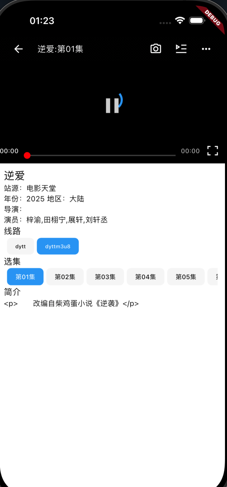

## 自学flutter，参考猫影视和FongMi影视的思想和UI的，使用flutter + nodejs开发ant影视，支持影视的t1(cms api)、t4 类型的配置 和 猫的nodejs 配置
### t1 & t4配置 [https://d.kstore.dev/download/8943/nodejs/api.json](https://d.kstore.dev/download/8943/nodejs/api.json)
```
{
	"sites": [{
			"key": "hmr",
			"name": "黑木耳",
			"type": 4,
			"api": "http://zhangqun66.com/225.php"
		},
		{
			"key": "wwdj",
			"name": "旺旺短剧",
			"type": 1,
			"api": "http://zhangqun1818.serv00.net:5052"
		}, {
			"key": "maotai",
			"name": "茅台(json)",
			"type": 1,
			"api": "https://caiji.maotaizy.cc/api.php/provide/vod/from/mtm3u8/at/josn/"
		}, {
			"key": "电影天堂",
			"name": "电影天堂",
			"type": 1,
			"api": "http://caiji.dyttzyapi.com/api.php/provide/vod",
			"ext": {
				"categories": ["国产剧", "爱情片", "喜剧片"]
			}
		}, {
			"key": "天涯采集",
			"name": "天涯采集",
			"type": 1,
			"api": "http://tyyszy.com/api.php/provide/vod"
		}
	]
}
```

### nodejs配置地址：
[https://14256.kstore.space/index.js.md5](https://14256.kstore.space/index.js.md5)

## 相关截图



